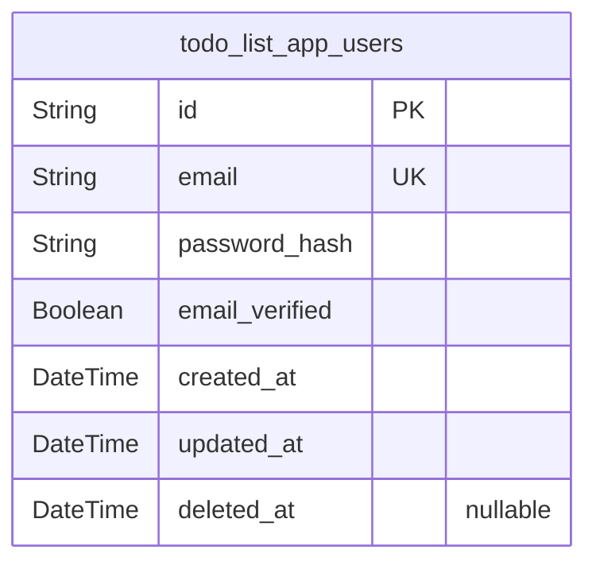
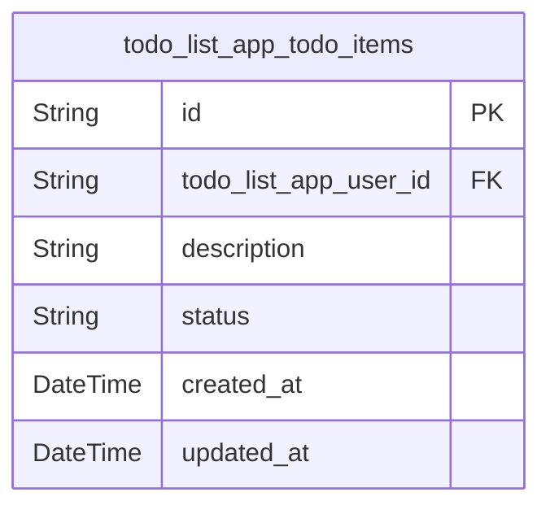

# Prisma Markdown

> Generated by [`prisma-markdown`](https://github.com/samchon/prisma-markdown)

- [Actors](#actors)
- [Todo](#todo)

## Actors

### `todo_list_app_users`

User accounts for the Todo List Application, storing authentication data
including email, password hash, email verification status, and
timestamps. This entity represents individual users who own todo items.
The table supports soft deletion for account recovery and provides audit
fields for tracking creation and modification times. Email is unique
allowing identification and login. Relates to todo_list_app_todo_items
for ownership of tasks.

Properties as follows:

- `id`: Primary Key.
- `email`: User's unique email address used for login and identity verification.
- `password_hash`: Hashed password for user authentication, never store plain text passwords.
- `email_verified`: Flag indicating whether the user's email address has been verified.
- `created_at`: Timestamp when the user account was created.
- `updated_at`: Timestamp when the user account was last updated.
- `deleted_at`
  > Timestamp indicating when the user account was soft deleted, if
  > applicable.

## Todo

### `todo_list_app_todo_items`

Represents individual todo items created and managed by users in the todo
list application. Each item is tied exclusively to one user, with a
status indicating completion state and timestamps for creation and last
update. This model enables users to independently create, view, update,
and delete their tasks while enforcing ownership and access control. It
references the users table for ownership association.

Properties as follows:

- `id`: Primary Key.
- `todo_list_app_user_id`: Owning user's [todo_list_app_users.id](#todo_list_app_users).
- `description`
  > Task description text. Non-empty string up to 256 characters, validated
  > by application logic.
- `status`: Task completion status, only 'pending' or 'done' values allowed.
- `created_at`: Timestamp when the todo item was created.
- `updated_at`: Timestamp when the todo item was last updated.
