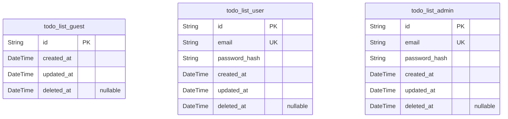
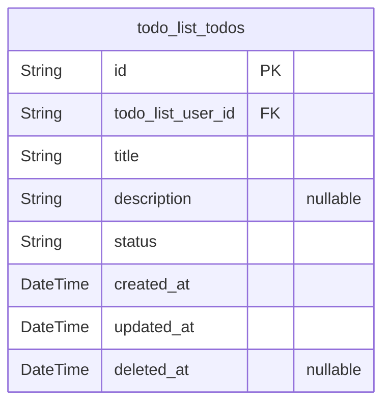

# Prisma Markdown

> Generated by [`prisma-markdown`](https://github.com/samchon/prisma-markdown)

- [Actors](#actors)
- [Todos](#todos)

## Actors

### `todo_list_guest`

Guest entities representing unauthenticated users with minimal
permissions. Guests do not require authentication fields like email or
password. This table supports managing guests as distinct actors with
limited access. It tracks creation, update, and deletion timestamps for
audit purposes.

Properties as follows:

- `id`: Primary Key.
- `created_at`: Timestamp when the guest record was created.
- `updated_at`: Timestamp when the guest record was last updated.
- `deleted_at`: Timestamp when the guest record was deleted (soft delete).

### `todo_list_user`

Authenticated user entities with login credentials and permissions to
manage their todos. Includes email and hashed password for
authentication. Enforces unique email. Tracks creation, update, and
deletion timestamps. Supports soft deletes.

Properties as follows:

- `id`: Primary Key.
- `email`
  > User email address used for authentication and contact. Must be unique
  > across users.
- `password_hash`
  > Hashed password for user authentication. Passwords must not be stored in
  > plain text.
- `created_at`: Timestamp when the user was created.
- `updated_at`: Timestamp when the user was last updated.
- `deleted_at`: Timestamp when the user was deleted (soft delete).

### `todo_list_admin`

Administrator users with elevated permissions and full system access.
Includes email and hashed password for authentication. Enforces unique
email addresses. Tracks creation, update, and deletion timestamps for
audit and soft delete purposes.

Properties as follows:

- `id`: Primary Key.
- `email`
  > Admin email address used for authentication and contact. Must be unique
  > across admins.
- `password_hash`
  > Hashed password for admin authentication. Passwords must never be stored
  > in plain text.
- `created_at`: Timestamp when the admin user was created.
- `updated_at`: Timestamp when the admin user was last updated.
- `deleted_at`: Timestamp when the admin user was deleted (soft delete).

## Todos

### `todo_list_todos`

Represents todo items owned by users. Each todo has a unique title per
user, supports statuses (pending, in-progress, completed), and stores
optional descriptions. Enables independent CRUD and filtering operations
by users. Maintains audit trail fields for creation, update, and optional
soft deletion. Foreign key to todo_list_user ensures ownership linkage.
Implements unique constraint on user and title for title uniqueness per
user.

Properties as follows:

- `id`: Primary Key.
- `todo_list_user_id`: Owner user's [todo_list_user.id](#todo_list_user).
- `title`: Title of the todo item; unique per user; max length 100.
- `description`: Optional detailed description of the todo item; max length 500.
- `status`
  > Status of the todo item; possible values: 'pending', 'in-progress',
  > 'completed'.
- `created_at`: Timestamp when the todo item was created.
- `updated_at`: Timestamp when the todo item was last updated.
- `deleted_at`: Soft delete timestamp; null means active.
