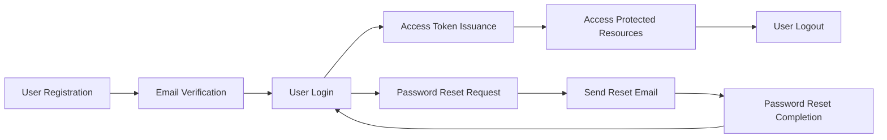
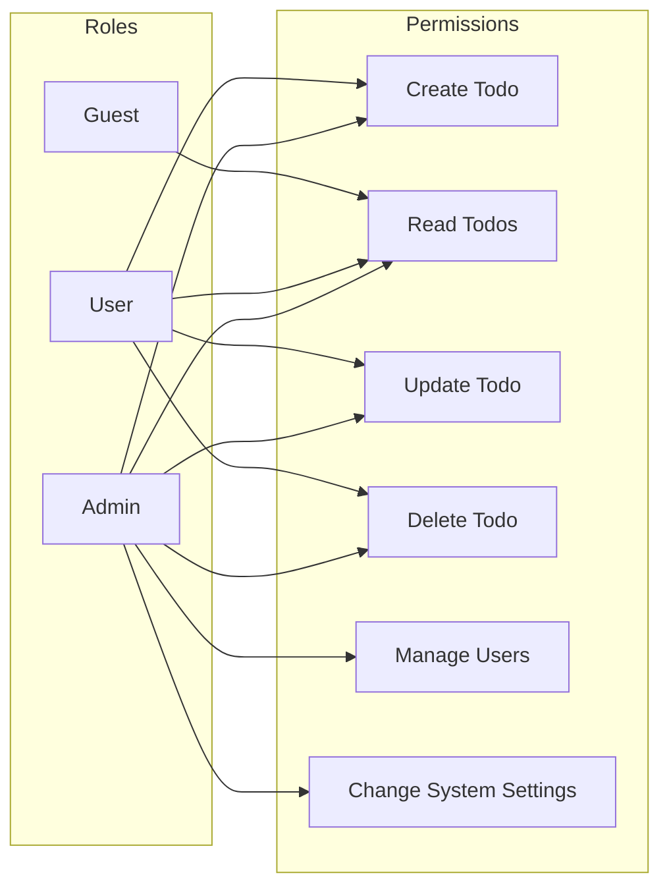

# Todo List Application - User Roles and Authentication Requirements

## Introduction
This document defines the user roles and authentication requirements for the Todo list application. These requirements ensure secure and appropriate access control across different user categories, supporting both security and usability objectives.

## User Role Definitions
The system defines three distinct user roles, each with specific permissions and constraints.

### 1. Guest
- Role Description: An unauthenticated user with strictly limited capabilities.
- Permissions:
  - Cannot create, update, or delete any todo items.
  - May view limited public information if the system exposes any (for extensibility, currently no public todos).
- Limitations:
  - Access to private or user-specific data is denied.

### 2. User
- Role Description: An authenticated user who can fully manage their own todos.
- Permissions:
  - Create new todo items.
  - Read all their own todo items.
  - Update their own todo items.
  - Delete their own todo items.
- Limitations:
  - Cannot access or modify other users' todos.
  - Cannot manage users or system-wide settings.

### 3. Admin
- Role Description: An administrator with full system access.
- Permissions:
  - Full CRUD (create, read, update, delete) access to all todos from all users.
  - Manage user accounts, including role assignment and deactivation.
  - Change system-wide settings.

## Authentication Flow Requirements
The authentication system must support the following core functionalities.

- WHEN a user registers, THE system SHALL create an inactive account and send a verification email.
- WHEN a user verifies their email, THE system SHALL activate the account.
- WHEN a user attempts login, THE system SHALL validate the credentials within 2 seconds and issue JWT tokens upon success.
- WHEN a user logs out, THE system SHALL invalidate the active session tokens.
- WHEN a user requests password reset, THE system SHALL send a password reset email with a secure token.
- WHEN a user submits a password reset token, THE system SHALL validate the token and allow password update.
- THE system SHALL lock user accounts for 10 minutes after 3 consecutive failed login attempts.
- THE system SHALL issue access tokens with a 15-minute expiration and refresh tokens with a 14-day expiration.

## Role Hierarchy and Permissions
The system enforces strict role-based access:

- Guests have minimal access, limited to public or no data.
- Users can operate on their own items only.
- Admins have unrestricted access and management privileges.

### JWT Token Management
- Access tokens SHALL contain claims for userId, role, and permissions.
- Access tokens SHALL expire 15 minutes after issuance.
- Refresh tokens SHALL expire 14 days after issuance.
- Users SHALL be able to revoke all active sessions, invalidating all tokens.

## Permission Matrix
| Action                    | Guest | User | Admin |
|---------------------------|-------|------|-------|
| Create todo               | ❌    | ✅   | ✅    |
| Read own todos            | ❌    | ✅   | ✅    |
| Read all todos            | ❌    | ❌   | ✅    |
| Update own todos          | ❌    | ✅   | ✅    |
| Delete own todos          | ❌    | ✅   | ✅    |
| Manage users              | ❌    | ❌   | ✅    |
| Change system settings    | ❌    | ❌   | ✅    |

## Sample Functional Requirements in EARS Format
- WHEN a guest attempts to create a todo, THEN THE system SHALL deny access with an authorization error.
- WHEN a user submits login credentials, THEN THE system SHALL validate and issue an access token within 2 seconds.
- IF a user provides invalid password three times consecutively, THEN THE system SHALL lock the account for 10 minutes.
- THE system SHALL expire access tokens after 15 minutes.

## Diagrams
### Authentication Workflow

### Role-Based Access Control

---

This document provides business requirements only. All technical implementation decisions belong to developers and are out of scope for this document. Developers have full autonomy regarding architecture, API design, and database schema. The document describes what the system shall do without specifying how to implement it.