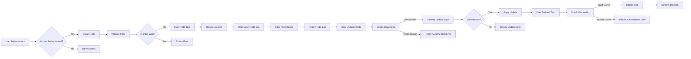

# Functional Requirements Analysis for Todo List Application

## 1. Introduction
This document defines the complete functional business requirements for the Todo List application. It covers the lifecycle of todo items and the interactions users will have with the system. The scope is limited to minimum viable functionality enabling users to create, read, update, and delete todo items securely and efficiently while respecting defined business rules.

This document provides business requirements only. All technical implementation decisions such as architecture, APIs, and database designs are at the discretion of the development team. Developers have full autonomy over how they implement these requirements.

## 2. Creating Todos
- WHEN an authenticated user submits a new todo item, THE system SHALL create a todo item associated with the user.
- WHEN creating a todo item, THE system SHALL require a non-empty title as input.
- WHERE a description is provided, THE system SHALL store the description alongside the todo item.
- WHEN a todo item is created, THE system SHALL set its status as "pending" by default.
- WHEN a todo item is created, THE system SHALL record its creation timestamp.
- IF the title is empty or missing, THEN THE system SHALL reject the creation request with an appropriate error message.
- THE system SHALL reject todo creation requests with title exceeding 100 characters with a validation error.

## 3. Reading Todos
- WHEN an authenticated user requests their todo list, THE system SHALL return all todo items owned by the user.
- THE system SHALL order the todo items by creation timestamp, newest first.
- WHERE filtering by status is requested, THE system SHALL return only todo items matching the specified status.
- WHEN a guest or unauthenticated user attempts to view todos, THEN THE system SHALL deny access with an appropriate error message.

## 4. Updating Todos
- WHEN an authenticated user submits updates to a todo item they own, THE system SHALL apply changes.
- THE system SHALL allow updating the title, description, and status of the todo item.
- WHEN updating the status, THE system SHALL accept only predefined statuses: pending, in-progress, completed.
- IF an invalid status value is submitted, THEN THE system SHALL reject the update with an appropriate error.
- IF a user attempts to update a todo they do not own, THEN THE system SHALL deny the request with an authorization error.
- IF the updated title is empty or exceeds 100 characters, THEN THE system SHALL reject the update with a validation error.
- IF the description exceeds 500 characters, THEN THE system SHALL reject the update with a validation error.

## 5. Deleting Todos
- WHEN an authenticated user requests deletion of a todo item they own, THE system SHALL delete the todo item.
- IF a user attempts to delete a todo they do not own, THEN THE system SHALL deny the request with an authorization error.
- WHEN a todo item is deleted, THE system SHALL ensure it is no longer retrievable by the user or any other user.

## 6. Business Rules and Validation
- THE system SHALL enforce that todo titles are unique per user.
- THE system SHALL limit todo title length to a maximum of 100 characters.
- THE system SHALL limit the description length to 500 characters.
- THE system SHALL prevent any todo operation from being performed by guests (unauthenticated users).
- THE system SHALL maintain data integrity for all todo operations.

## 7. Error Handling
- IF any required field is missing or invalid, THEN THE system SHALL return an HTTP 400 Bad Request with details.
- IF authentication fails or user is unauthorized for the requested operation, THEN THE system SHALL return HTTP 401 Unauthorized or 403 Forbidden accordingly.
- IF the requested todo item does not exist or is not accessible by the user, THEN THE system SHALL return HTTP 404 Not Found.
- THE system SHALL return clear, user-readable error messages for all error responses.

## 8. Performance Expectations
- WHEN a user creates, reads, updates, or deletes todo items, THE system SHALL process and respond within 2 seconds under normal load.
- THE system SHALL support at least 1000 concurrent authenticated users performing CRUD operations without degradation.

## Mermaid Diagram: Todo Item Lifecycle and User Interactions

This completes the core functional requirements to enable backend developers to build the minimal Todo list application with clear, measurable, and actionable requirements.