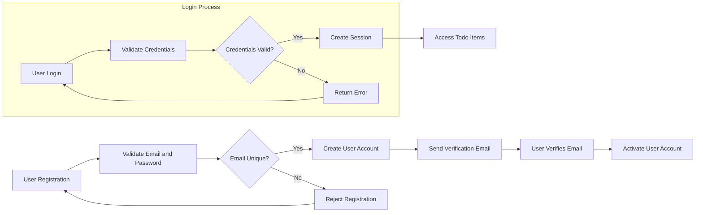

# User Roles and Authentication for Todo list application

## 1. Introduction
This document provides the complete business requirements for user roles, authentication flows, and permissions for the Todo list application backend. It focuses on minimal functional scope for a simple Todo list app where a single type of authenticated user can manage their own tasks.

This document provides business requirements only. All technical implementation decisions including architecture, APIs, and database design are at the discretion of the development team. The document prescribes WHAT the system must do, not HOW it shall be built.

## 2. User Role Definitions

### 2.1 User Roles Overview
There is only one user role in this system:

| Role Name | Description |
|-----------|-------------|
| user      | Authenticated users who can create, read, update, and delete their own todo items. They have personal access and full management rights over their tasks. |

### 2.2 Role Characteristics
- Users are individuals who register and authenticate with the system.
- Each user can only access and manage their own todo items.
- There are no administrative or multi-user roles currently.

## 3. Authentication Flow Requirements

### 3.1 Core Authentication Functions
- THE todoListApp SHALL allow users to register an account with an email address and password.
- WHEN a user submits registration data, THE todoListApp SHALL validate the email format and password strength.
- THE todoListApp SHALL allow users to log in using email and password credentials.
- WHEN a user submits login credentials, THE todoListApp SHALL verify them and establish a secure user session.
- THE todoListApp SHALL provide a logout function that invalidates the user session.
- WHEN a user requests password reset, THE todoListApp SHALL provide a mechanism to securely reset the password via email.
- THE todoListApp SHALL maintain authenticated user sessions securely until logout or session expiration.
- THE todoListApp SHALL enforce a session expiration time of 30 minutes of inactivity.
- THE todoListApp SHALL require users to verify their email addresses before gaining full access.
- WHEN a user attempts to access any Todo item data, THE todoListApp SHALL verify the user is authenticated.

### 3.2 Registration
- WHEN a new user registers, THE todoListApp SHALL ensure the email is unique in the system.
- IF the email is already registered, THEN THE todoListApp SHALL reject registration with an appropriate error message.

### 3.3 Password Rules
- THE todoListApp SHALL require passwords to be at least 8 characters long.
- THE todoListApp SHALL enforce password complexity rules (at least one uppercase letter, one number, and one special character).

### 3.4 Email Verification
- THE todoListApp SHALL send a verification email upon registration.
- WHEN the user clicks the verification link, THE todoListApp SHALL mark the email as verified.
- IF the user has not verified their email within 24 hours, THEN THE todoListApp SHALL restrict access to todo item management features.

### 3.5 Error Handling
- IF login credentials are invalid, THEN THE todoListApp SHALL return an authentication failure error.
- IF the user attempts actions without authentication, THEN THE todoListApp SHALL reject with appropriate authorization error.

## 4. Permission Matrix

| Action               | user (Authenticated) |
|----------------------|---------------------|
| Register             | ✅                  |
| Login                | ✅                  |
| Logout               | ✅                  |
| Create Todo Item     | ✅                  |
| Read Own Todo Items  | ✅                  |
| Update Own Todo Item | ✅                  |
| Delete Own Todo Item | ✅                  |
| Access Others' Items | ❌                  |
| Manage Other Users   | ❌                  |

### 4.1 Access Control Rules
- Users SHALL only be able to access todo items they own.
- Any attempt to access or modify todo items belonging to another user SHALL be rejected.

## 5. Summary
This document specifies a single user role "user" who can fully manage their own todo items. It details all authentication flows including registration, login, logout, email verification, and session management with explicit rules on password complexity and error handling.
The permission matrix clearly defines capabilities limited to the user's own data.

Mermaid Diagram illustrating Authentication Flow:

This document covers only business requirements for user roles and authentication in natural language and EARS format. All technical realizations including API design, database schemas, and security implementations are left to developers' discretion.